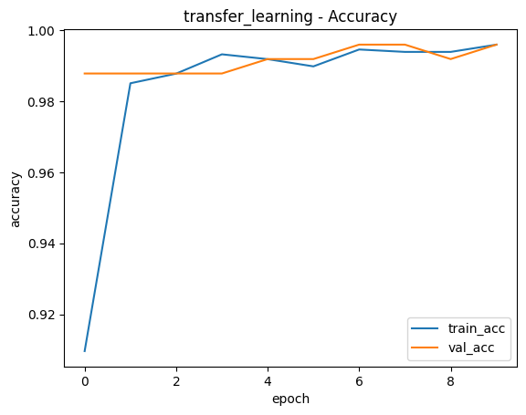
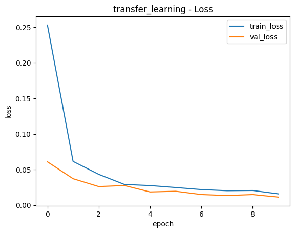
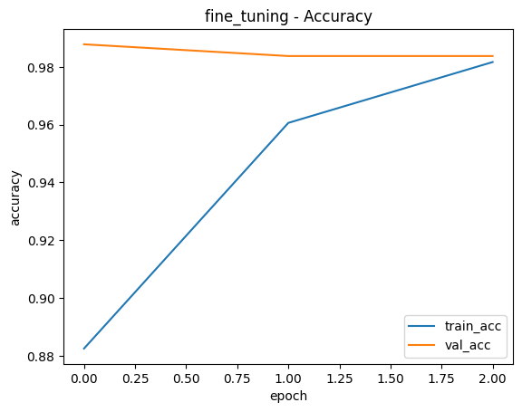
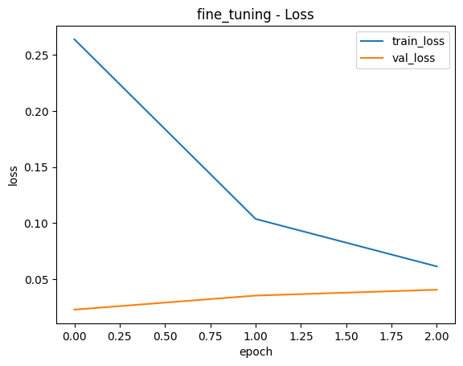
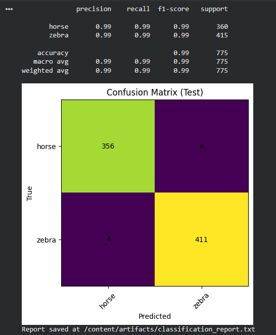

# 🧠 Deep Transfer Learning
## Reusable Transfer Learning Template for Binary Image Classification

This repository provides a structured, reproducible, and dataset-agnostic **Transfer Learning pipeline** built with TensorFlow and Keras.

The main notebook:

`transfer_learning_template.ipynb`

implements a complete workflow for binary image classification using a pre-trained convolutional neural network (**MobileNetV2 trained on ImageNet**).

The project is designed as a reusable template that can be adapted to different binary classification datasets with minimal changes.

---

# 🚀 Project Objective

This project demonstrates how Transfer Learning can be effectively applied to image classification problems using:

- Pre-trained ImageNet models
- Optimized TensorFlow data pipelines
- Controlled fine-tuning
- Automatic best-model selection
- Final evaluation on unseen test data

The structure is modular and suitable for real-world computer vision applications.

---

# 🧠 Model Architecture

## Base Model
- MobileNetV2 (ImageNet pre-trained)
- include_top=False

## Custom Classification Head
- GlobalAveragePooling2D
- Dropout (0.2)
- Dense (1 neuron, sigmoid activation)

Loss Function: `binary_crossentropy`  
Optimizer: `Adam`

---

# 🔄 Training Strategy

The notebook implements two training phases:

## 1️⃣ Transfer Learning (Feature Extraction)
- Base model frozen
- Only classification head trained
- EarlyStopping enabled
- ModelCheckpoint enabled

## 2️⃣ Fine-Tuning
- Last 80 layers unfrozen
- Lower learning rate (1e-5)
- Best fine-tuned model automatically saved

---

# 🏆 Automatic Model Selection

After both training phases:

- The model with the lowest validation loss is selected automatically.
- Fine-tuning is retained only if it improves validation performance.
- The final model is saved as:

`best_model.keras`

This ensures reproducibility and prevents manual bias.

---

# 📂 Expected Dataset Structure

```
dataset/
├── train/
│   ├── class_A/
│   └── class_B/
├── val/
│   ├── class_A/
│   └── class_B/
└── test/
    ├── class_A/
    └── class_B/
```

For demonstration purposes, a Horses vs Zebras dataset was used.  
However, the template works with any binary dataset structured as above.

---

# 📊 Example Results (Case Study)

Using the Horses vs Zebras dataset:

- Best Validation Loss: 0.01138
- Test Accuracy: 0.9897
- Only 8 misclassifications out of 775 test images

Fine-tuning did not improve validation performance in this case, demonstrating that pre-trained ImageNet features were already sufficient.

---

# 📈 Training Visualizations

## Transfer Learning Phase

### Accuracy


### Loss


---

## Fine-Tuning Phase

### Accuracy


### Loss


---

## Confusion Matrix (Test Set)



---

# 📁 Generated Artifacts

The notebook automatically generates:

- Accuracy plots
- Loss plots
- Confusion matrix
- Classification report (classification_report.txt)
- Saved best model

Artifacts are stored inside:

`artifacts/`

---

# ▶️ How to Run

1. Open `transfer_learning_template.ipynb` in Google Colab
2. Run all cells sequentially
3. The dataset will be downloaded automatically
4. The model will train, evaluate, and generate artifacts

To use your own dataset:

- Replace the dataset directory
- Maintain the same folder structure
- Adjust class names if necessary

---

# 🛠 Requirements

- Python 3.x
- TensorFlow 2.x
- scikit-learn
- gdown

Install dependencies:

```bash
pip install tensorflow scikit-learn gdown
```

---

# 📌 Key Takeaways

- Transfer Learning significantly reduces training time
- ImageNet pre-trained models generalize well to new tasks
- Fine-tuning must be applied carefully
- Automatic model selection improves reliability
- The template is reusable and production-ready

---

# 📄 License

This project is provided for educational and experimental purposes.

